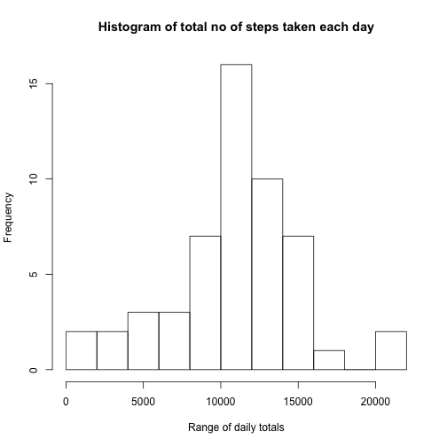
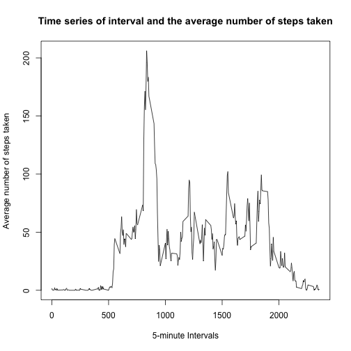
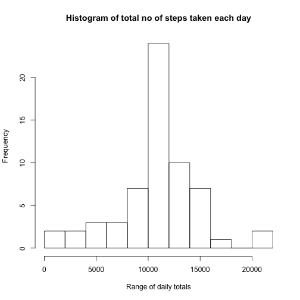
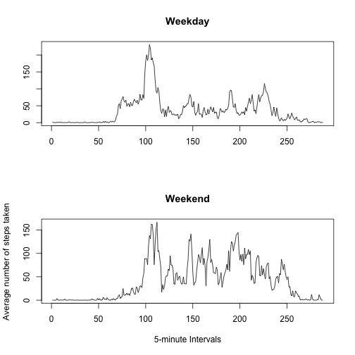

# Histogram of Total Number of steps taken each day


```r
library(ggplot2)
library(dplyr)
data <- read.csv('/Users/hganeshmurthy/git/RepData_PeerAssessment1/activity.csv')
data$date <- as.Date(data$date)

group_data_set <- data %>% na.omit() %>% select (steps, date)  %>% group_by(date) %>% summarise_each(funs(sum))
 hist(group_data_set$steps, xlab="Range of daily totals", breaks =10, main = "Histogram of total no of steps taken each day")
```

 

## Mean of the total steps taken each day 


```r
mean(group_data_set$steps) 
```

```
## [1] 10766.19
```

## Median of the total steps taken each day 


```r
median(group_data_set$steps) 
```

```
## [1] 10765
```

### Time series of the 5-minute interval (x-axis) and the average number of steps taken, averaged across all days (y-axis)


```r
library(ggplot2)
library(dplyr)
data <- read.csv('/Users/hganeshmurthy/git/RepData_PeerAssessment1/activity.csv')
data$date <- as.Date(data$date)

group_data_set <- data %>% na.omit() %>% select (steps, interval) %>% group_by(interval) %>% summarise_each(funs(mean))

plot(group_data_set, type='l', xlab="5-minute Intervals", ylab="Average number of steps taken", breaks =10, main = "Time series of interval and the average number of steps taken")
```

```
## Warning in plot.window(...): "breaks" is not a graphical parameter
```

```
## Warning in plot.xy(xy, type, ...): "breaks" is not a graphical parameter
```

```
## Warning in axis(side = side, at = at, labels = labels, ...): "breaks" is
## not a graphical parameter
```

```
## Warning in axis(side = side, at = at, labels = labels, ...): "breaks" is
## not a graphical parameter
```

```
## Warning in box(...): "breaks" is not a graphical parameter
```

```
## Warning in title(...): "breaks" is not a graphical parameter
```

 
 
#### The interval, on average across all the days in the dataset, contains the maximum number of steps


```r
library(ggplot2)
library(dplyr)
data <- read.csv('/Users/hganeshmurthy/git/RepData_PeerAssessment1/activity.csv')
data$date <- as.Date(data$date)
group_data_set <- data %>% na.omit() %>% select (steps, interval) %>%group_by(interval) %>% summarise_each(funs(mean))
filter <- group_data_set %>% filter(steps ==max(group_data_set$steps))
filter$interval
```

```
## [1] 835
```

##### The total number of missing values in the dataset 


```r
library(ggplot2)
library(dplyr)
data <- read.csv('/Users/hganeshmurthy/git/RepData_PeerAssessment1/activity.csv')
data$date <- as.Date(data$date)
sum(is.na(data$steps))
```

```
## [1] 2304
```

###### Filling in all of the missing values in the dataset
We will be using the mean for that 5 minute interval to fill in the missing values for the data set

```r
library(ggplot2)
library(dplyr)
data <- read.csv('/Users/hganeshmurthy/git/RepData_PeerAssessment1/activity.csv')
data$date <- as.Date(data$date)
mean_value_data_set <- data %>% na.omit() %>% select (steps, interval) %>%group_by(interval) %>% summarise_each(funs(mean))


data2 <- merge(data,mean_value_data_set,by="interval")

for(i in 1:nrow(data2)){
  if(is.na(data2[i,"steps.x"])){        
    data2[i, "steps.x"] <- data2[i, "steps.y"]     
  }  
}

data <-data2
data$date <- as.Date(data$date)
```


####### Histogram of Total Number of steps taken each day


```r
library(ggplot2)
library(dplyr)
library(ggplot2)
library(dplyr)
data <- read.csv('/Users/hganeshmurthy/git/RepData_PeerAssessment1/activity.csv')
data$date <- as.Date(data$date)
mean_value_data_set <- data %>% na.omit() %>% select (steps, interval) %>%group_by(interval) %>% summarise_each(funs(mean))


data2 <- merge(data,mean_value_data_set,by="interval")

for(i in 1:nrow(data2)){
  if(is.na(data2[i,"steps.x"])){        
    data2[i, "steps.x"] <- data2[i, "steps.y"]     
  }  
}

data <-data2
data$date <- as.Date(data$date)

group_data_set <- data %>% select (steps.x, date)  %>% group_by(date) %>% summarise_each(funs(sum))
 hist(group_data_set$steps.x, xlab="Range of daily totals", breaks =10, main = "Histogram of total no of steps taken each day")
```

 

######## Mean of the total steps taken each day 


```r
mean(group_data_set$steps.x) 
```

```
## [1] 10766.19
```

######## Median of the total steps taken each day 


```r
median(group_data_set$steps.x) 
```

```
## [1] 10766.19
```


######### Patterns between weekdays and weekends


```r
 library(lubridate)
library(ggplot2)
library(dplyr)
data <- read.csv('/Users/hganeshmurthy/git/RepData_PeerAssessment1/activity.csv')
data$date <- as.Date(data$date)
mean_value_data_set <- data %>% na.omit() %>% select (steps, interval) %>%group_by(interval) %>% summarise_each(funs(mean))


data2 <- merge(data,mean_value_data_set,by="interval")

for(i in 1:nrow(data2)){
  if(is.na(data2[i,"steps.x"])){        
    data2[i, "steps.x"] <- data2[i, "steps.y"]     
  }  
}

data <-data2
data$date <- as.Date(data$date)


for(i in 1:nrow(data)){
  if(weekdays(data[i,"date"], abbr = TRUE) %in% c("Sat","Sun") )
    {        
    data[i, "weekend"] <- 1    
     }  
  if(!weekdays(data[i,"date"], abbr = TRUE) %in% c("Sat","Sun") )
    {
    data[i, "weekday"] <- 1
    }
}
 
 #group_data_set <- data %>% filter(if(weekdays(data$date, abbr = TRUE) ) == "Sat")%>% select (steps.x, interval) %>% group_by(interval) %>% summarise_each(funs(mean))
 
 weekday_data <- data %>% filter(weekday == 1) %>% select (steps.x, interval) %>%group_by(interval) %>% summarise_each(funs(mean))
 weekend_data <- data %>% filter(weekend == 1) %>% select (steps.x, interval) %>%group_by(interval) %>% summarise_each(funs(mean))
 
 total_data <- merge(weekday_data,weekend_data, by="interval")

 names(total_data) <- c("inteval","weekday_steps","weekend_steps")
 
  par(mfrow=c(2,1))
  
plot(x<- total_data$weekday_steps, type='l',xlab="",ylab="", main = "Weekday") 

plot(x<- total_data$weekend_steps, type='l', xlab="5-minute Intervals", ylab="Average number of steps taken",  main = "Weekend") 
```

 
